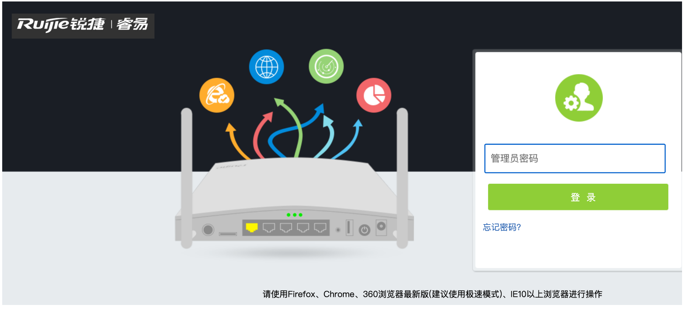
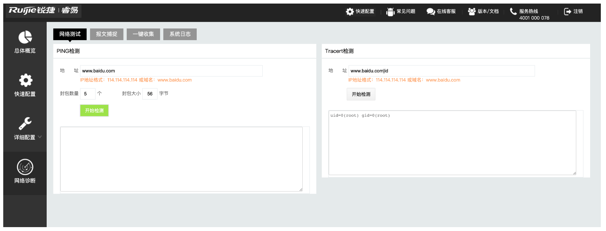

# 锐捷 BCR商业无线云网关 后台命令执行漏洞

## 漏洞描述

锐捷 BCR商业无线云网关 存在后台命令执行漏洞，攻击者通过默认口令可以登陆后台构造特殊的参数执行任意命令，获取服务器权限

## 漏洞影响

锐捷 BCR商业无线云网关

## 网络测绘

```
fid="N3IFMflkcmNQ2s4vuAhjzg=="
```

## 漏洞复现

登陆页面



通过弱口令登陆后台 admin 拼接命令

