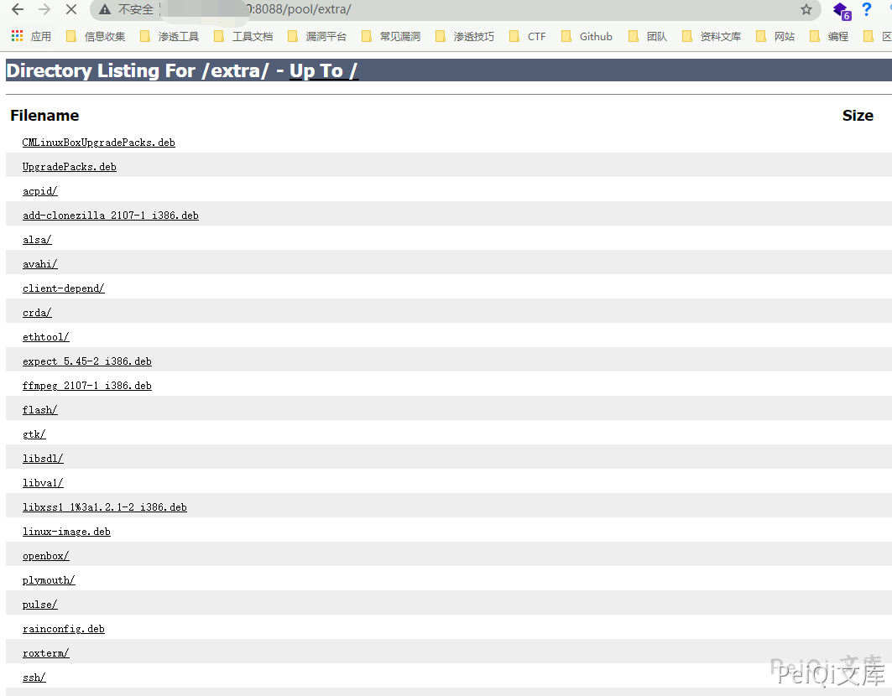

# 锐捷 云课堂主机 pool 目录遍历漏洞

## 漏洞描述

锐捷云课堂主机存在目录遍历漏洞，通过访问get请求/pool/，即可读取目录.导致敏感信息泄露.

## 漏洞影响

```
锐捷云课堂
```

## 网络测绘

```
title="Ruijie" && "云课堂主机"
```

## 漏洞复现

访问 http://xxx.xxx.xxx.xxx/pool 造成目录遍历

